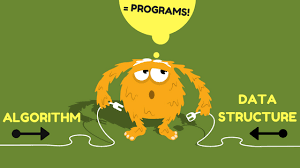

==============
Data Structure
==============
The Bigger Picture
------------------
Some say, the two most important elements in programming skills are **Data Structure** and **Algorithm**. 

   "Bad programmers worry about the code. Good programmers worry about data structures and their relationships." 
   -- Linus Torvalds

Data Structure is how you organize data (hence, structure) while algorithm is the approach to solve a problem (i.e. search, sort). 
If you have selected the right data structure and use the right algorithm for a specific problem, your program can do its job lightning fast. 

Python provides many built-in data types and it's very critical to learn how to use them effectively. This topic will introduce you to  
the three most popular ones - **list**, **tuple** and **dictionary**.

Syntax and Semantics - Learning Python Grammar
----------------------------------------------
Explore on your own to try the grasp how to create list and tuple. Play with the built-in methods at :ref:`Quick Resources <quick-resources-data-structure>`. Also use ``type()`` built-in function to check the data type.

Open up IDLE.

>>> ['hello', 3.1415, True, None, 42]
>>> my_list = ['cat', 'bat', 'rat', 'elephant', ]
>>> type(my_list)

>>> my_list[0]
>>> my_list[3]
>>> my_list[-1]
>>> my_list[1:3]
>>> my_list[:2]
>>> my_list[10000]
>>> len(my_list)

>>> nested_list = [['cat', 'bat'], [10, 20, 30, 40, 50]]
>>> nested_list[0]
>>> nested_list[0][1]
>>> nested_list[1][4]

>>> my_list = ['cat', 'bat', 'rat', 'elephant']
>>> my_list[1] = 'unicorn'
>>> my_list

>>> ([1, 2, 3] + ['A', 'B', 'C'])
>>> ['X', 'Y', 'Z'] * 3
>>> my_list = [1, 2, 3]
>>> my_list = my_list + ['X', 'Y', 'Z']
>>> del my_list[2]

>>> my_tuple = ('physics', 'chemistry', 1997, 2000, )
>>> nested_tuple = my_tuple, (1, 2, 3, 4, 5)
>>> my_tuple[0]
>>> my_tuple[1:2]

>>> my_tuple[0] = 'math'

>>> location_tuple = 12902312.231, 48509213.342, 'Kuala Lumpur'
>>> latitude, longtitude, location =  location_tuple

Now explore on your own to create dictionary!

>>> {"first_name": "John", "last_name": "Doe"}
>>> my_info_dict = { "first_name": "Jane",
                    "last_name": "Doe",
                    "location": "kuala lumpur",
                    "age": 28}
>>> type(my_info_dict)
>>> my_info_dict["first_name"]
>>> country_dict = { 1: "Malaysia", 2: "Singapore", 3: "Vietnam"}

>>> my_info_dict = { "first_name": "Jane",
                    "last_name": "Doe",
                    "location": "kuala lumpur",
                    "age": 28, 
                    "family" : ["john doe", "larry doe", "mary doe"]} 
>>> my_info_dict["family"]

>>> picnic_items_dict = {'apples': 5, 'cups': 2}
>>> print('I am bringing ' + str(picnic_items_dict.get('cups', 0)) + ' cups.')
>>> print('I am bringing ' + str(picnic_items_dict.get('eggs', 0)) + ' eggs.')

Critical Thinking - Discussions
-------------------------------
1. Does the list slicing (i.e. ``my_list[1:2]``) and operator remind you of anything we learnt earlier?
2. Can you modify value for list or tuple? Why?
3. What are the differences and similarities between list and tuple have you discovered?
4. Can you store a tuple in a list? How about vice versa? Try it out !
5. When do you think you should use list vs tuple?

.. topic:: FAQ / Fun Facts

    | 1. There are a few famous data structure like :-  

         * Queue
         * Stack 
         * Hash Map
         * Tree
         * Graph
    
    | 2. Python has it's own built-in data type to represent data structure above. For example:-  
    
         * List as Queue or Stack
         * Dictionary as Hash Map

    | 3. Why does Python allows comma at the end of lists and tuples?
    | Refer to Python Design at :ref:`Quick Resources <quick-resources>`.
    
Problem Solving
---------------
Warning: The exercise below is a little more advance. Try it to emphasize your understanding of variables !

>>> opposites = {'up': 'down', 'right': 'wrong', 'true': 'false'}
>>> alias = opposites
>>> alias is opposites

>>> alias['right'] = 'left'
>>> opposites['right']

1. Why is updating ``alias`` also changes ``opposites``?
2. What do you need to do if you don't want changes in ``alias`` to impact ``opposites``? Hint: ``copy()``
3. Work on these list and dictionary `assignments <https://repl.it/classroom/invite/PrZasLE>`_ .Only work on the first four "Dictionary" assignments. The football ones will be covered in the `Looping` topic.

Remember
--------
1. List and Tuple are sequences - element is in the order you insert.
2. Dictionary is key/value pair. We store value and use keys to access it.
3. Take full advantage of Python built-in data structure and its methods - tuple, list, dictionary.
4. The idea is to learn about data structures so you can select the right one to solve a specific problem. There's no one size fits all.

.. image:: images/ds_comparisons.png

.. _quick-resources-data-structure:

Quick Resources
---------------
1. Python data structure in detail - https://docs.python.org/3/tutorial/datastructures.html
2. Python built-in data types - https://docs.python.org/3/library/stdtypes.html
3. Python Design - https://docs.python.org/3/faq/design.html#why-does-python-allow-commas-at-the-end-of-lists-and-tuples
