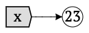
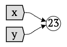
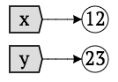
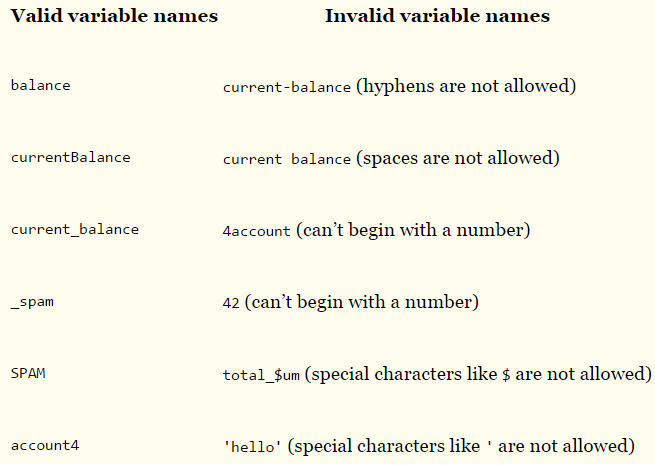
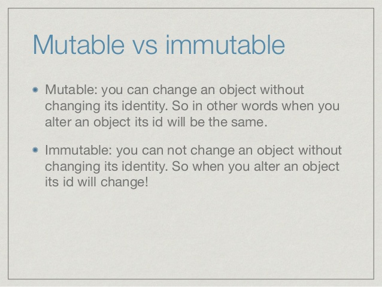
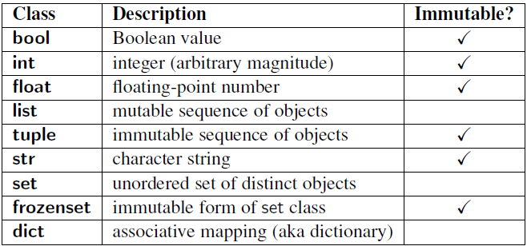

=================================
Variables, Statement & Expression
=================================
The Bigger Picture
------------------
In a nutshell, a computer program takes an input, store some values in the memory, do some processing and output the results. 

Let's talk about storing values. How do you do that? 

Syntax and Semantics - Learning Python Grammar
----------------------------------------------
.. code-block:: python
    :linenos:
    :caption: Sample Code - Variables!

    x = 23
    y = x
    x = 12

Diagrams representing code above:

Every unique value is stored in memory slot. Each memory slot comes with a unique address id. 
You can name a variable anything as long as it obeys the following three rules:

* It can be only one word.
* It can use only letters, numbers, and the underscore (_) character.
* It can’t begin with a number.

Explore on your own to create variables. You can check the memory address slot using ``id()`` built-in function. 
Open up IDLE.

>>> x = 23 # sample statement
>>> id(x)
>>> y = x 
>>> id(y)
>>> x = 12 
>>> id(x)
>>> id(11 + 12) # sample expression
>>> id(True) # bool data type
>>> id(2 > 1) 

Critical Thinking - Discussions
-------------------------------
1. In the statement ``y = x``, does program creates two values or one ?
2. What did you notice about address id above? Which are the same and which are not?
3. What did you notice about ``2 > 1`` expression above ? 
4. If every value is stored in a memory slot (with it's unique memory address), what happens if memory slot is filled ?

.. topic:: FAQ / Fun Facts

    | 1. What's the answer to discussion #1 above? 
    | I am glad you ask. You have two variable names (i.e. x, y) and only one value (i.e. 23).
    
    | 2. What are all the operators (i.e. math, comparison) in Python?  
    | Refer to :ref:`Quick Resources <quick-resources-var>` for all the built-in functions and data types available in Python.

    | 3. The ability to store values is what makes a computer program really powerful ! 

    | 4. Code statement vs math statement. In math, you can have x + 2 = 5 but in coding, you can only have variable name on the left (i.e. x = y + 12).

Mutability vs Immutability - Sneak Peak
---------------------------------------
You probably have notice by now all memory address ``id()`` changes whenever the value changes. 
This is because the some data types are immutable.  

Fyi, data types are further categorize into two types:-

We'll revisit this in the later topics.

Best Practices
--------------
1. Give meaningful and descriptive name to your variable. 
    .. code-block:: python
        :linenos:
        :caption: Sample Variables Naming

        x = 3.142 # bad
        pi = 3.142 # good
2. Check out the famous `PEP-8 Python style-guide <https://www.python.org/dev/peps/pep-0008/#naming-conventions>`_ on how to name your variables.

Remember
--------
1. A variable name is just a container that **holds the memory address of where the value is stored**. 
2. Statement is an **instruction**. Hence, assigning x = 12 is a statement. We'll learn other statements later in the course.
3. An expression is **simply a value**. It can be a form of operation (i.e. add, compare) which eventually outputs a value.

.. _quick-resources-var:

Quick Resources
---------------
1. Full list of Python operator - https://docs.python.org/3/library/operator.html
2. `PyCon 2015: Python Names and Values, Ned Batchelder <https://nedbatchelder.com/text/names1.html>`_.
3. Python expressions list - https://docs.python.org/3/reference/expressions.html
4. Python simple statement list - https://docs.python.org/3/reference/simple_stmts.html
5. Python compund statement list - https://docs.python.org/3/reference/compound_stmts.html
